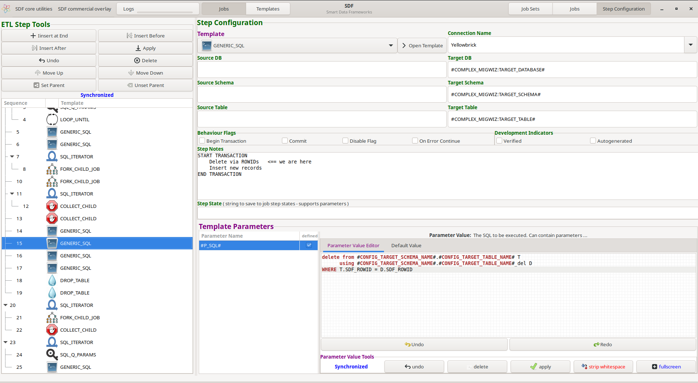

Welcome to Smart Data Frameworks ( SDF ) , a mature, industry-hardened ETL/ELT ( extract, load, transform ) framework.

SDF consists broadly of 2 codebases:
 - smart_etl - a console-based execution framework
 - smart_gui - the user interface

The flatpak directory contains everything needed to build a flatpak container ( https://www.flatpak.org ).

New users will most likely want to install via the Flatpak build. Note that buildings from scratch
is quite a long and challenging process. To install the flatpak container:

## Download the gpg file:
wget https://tesla.duckdns.org/SmartDataFramework/open.sdf.gpg

## Register the gpg file:
sudo flatpak remote-add --gpg-import=open.sdf.gpg open.sdf https://tesla.duckdns.org/SmartDataFramework

## Add the Gnome 45 environment:
sudo flatpak install flathub org.gnome.Platform//45

# Install Open SDF:
sudo flatpak install --from https://tesla.duckdns.org/SmartDataFramework/sdf-1.1.flatpakrepo

